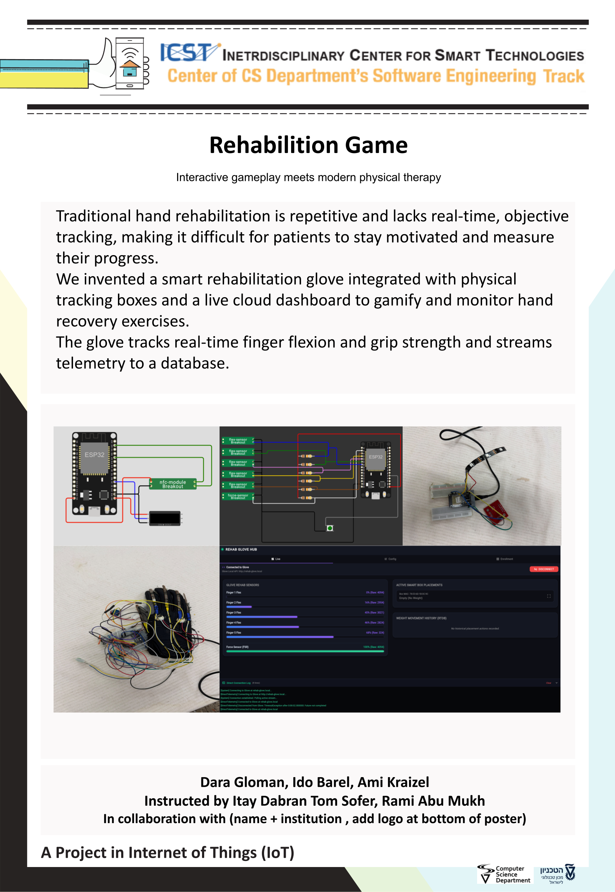

## Rehab Glove Project by :

Dara Glozman

Ami Kraizel

Ido Barel

## Details about the project

## Folder description :

* ESP32: source code for the esp side (firmware).
* Documentation: wiring diagram + basic operating instructions
* Unit Tests: tests for individual hardware components (input / output devices)
* flutter\_app : dart code for our Flutter app.
* Parameters: contains description of parameters and settings that can be modified IN YOUR CODE
* Assets: link to 3D printed parts, Audio files used in this project, Fritzing file for connection diagram (FZZ format) etc

## ESP32 SDK version used in this project:

DOIT ESP32 DEVKIT V1

## Arduino/ESP32 libraries used in this project:

* Adafruit PN532 - version 1.3.4
* Adafruit Neopixel - version 1.15.5
* Adafruit DRV2605 - version 1.2.4
* Adafruit BusIO - version 1.17.4

## Connection diagram:

* [Glove Connection Diagram](Documentation/connection%20diagram/Glove.png)
* [Main Box Connection Diagram](Documentation/connection%20diagram/Main%20Box.png)
* [Smart Box Connection Diagram](Documentation/connection%20diagram/Smart%20Box.png)

## Project Poster:

This project is part of ICST - The Interdisciplinary Center for Smart Technologies, Taub Faculty of Computer Science, Technion
https://icst.cs.technion.ac.il/

